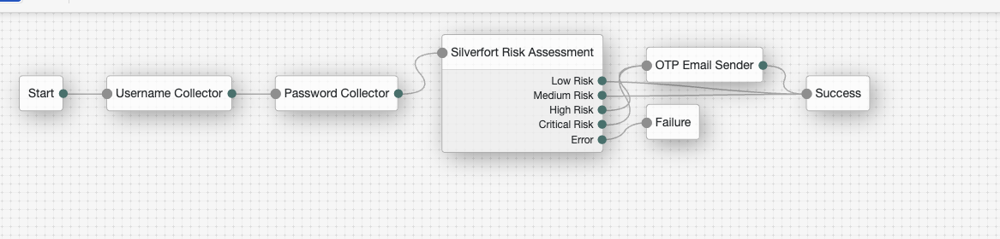
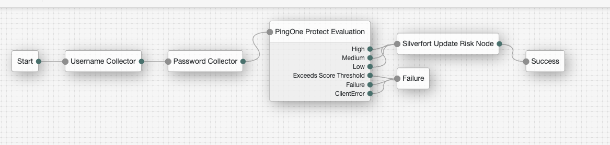

<!--
 * The contents of this file are subject to the terms of the Common Development and
 * Distribution License (the License). You may not use this file except in compliance with the
 * License.
 *
 * You can obtain a copy of the License at legal/CDDLv1.0.txt. See the License for the
 * specific language governing permission and limitations under the License.
 *
 * When distributing Covered Software, include this CDDL Header Notice in each file and include
 * the License file at legal/CDDLv1.0.txt. If applicable, add the following below the CDDL
 * Header, with the fields enclosed by brackets [] replaced by your own identifying
 * information: "Portions copyright [year] [name of copyright owner]".
 *
 * Copyright 2025 Ping Identity Corporation.
-->
# SilverfortRiskNode

A node for pulling Risk from Silverfort for [Identity Platform][forgerock_platform] 8.0.1 and above. This node will pull the Risk Level for a specific user in Silverfort (low, medium, high, critical) based on the User Identifier Attribute, which can then be used for further evaluation within the tree.

**Configuration**

| Property                      | Description                                                                                                                                                                                                                                      |
|-------------------------------|--------------------------------------------------------------------------------------------------------------------------------------------------------------------------------------------------------------------------------------------------|
| **Silverfort API URL**        | The base URL for the Silverfort API (e.g. https://global.services.silverfort.com)                                                                                                                                                                |
| **Authentication ID**         | The authentication ID provided by Silverfort for API access                                                                                                                                                                                      |
| **Webhook ID**                | The webhook ID provided by Silverfort for this integration                                                                                                                                                                                       |
| **User Identifier Attribute** | The LDAP attribute containing the user identifier that matches the UPN in Silverfort. Common values: uid, mail, userPrincipalName. This value must match how users are identified in Silverfort. Defaults to username to pull from shared state. |
| **Timeout (seconds)**         | The timeout in seconds for API calls to Silverfort (default: 30)                                                                                                                                                                                 |

# SilverfortUpdateRiskNode

A node for pushing Risk to Silverfort for [Identity Platform][forgerock_platform] 8.0.1 and above. This node will read the Risk Level for a specific user from the shared state using the configured User Identifier Attribute, which will then be used to update Silverfort's Risk.

**Configuration**

| Property                      | Description                                                                                                                                                                                                                                      |
|-------------------------------|--------------------------------------------------------------------------------------------------------------------------------------------------------------------------------------------------------------------------------------------------|
| **Silverfort API URL**        | The base URL for the Silverfort API (e.g. https://global.services.silverfort.com)                                                                                                                                                                |
| **Authentication ID**         | The authentication ID provided by Silverfort for API access                                                                                                                                                                                      |
| **Webhook ID**                | The webhook ID provided by Silverfort for this integration                                                                                                                                                                                       |
| **User Identifier Attribute** | The LDAP attribute containing the user identifier that matches the UPN in Silverfort. Common values: uid, mail, userPrincipalName. This value must match how users are identified in Silverfort. Defaults to username to pull from shared state. |
| **Risk Source Key**           | The shared state key to read the risk level from. Defaults to PingOneProtectEvaluationNode.RISK to use risk from PingOne Protect. Can be configured to use risk from another shared state location.                                              |
| **LOW Risk Triggers**         | Comma-separated list of risk values that should map to Silverfort LOW risk level (e.g., "Low,Minimal"). Default: "Low"                                                                                                                           |
| **MEDIUM Risk Triggers**      | Comma-separated list of risk values that should map to Silverfort MEDIUM risk level (e.g., "Medium,Moderate"). Default: "Medium"                                                                                                                 |
| **HIGH Risk Triggers**        | Comma-separated list of risk values that should map to Silverfort HIGH risk level (e.g., "High,Elevated"). Default: "High"                                                                                                                       |
| **CRITICAL Risk Triggers**    | Comma-separated list of risk values that should map to Silverfort CRITICAL risk level (e.g., "Critical,Severe"). Leave empty to not explicitly match any values.                                                                                 |
| **Timeout (seconds)**         | The timeout in seconds for API calls to Silverfort (default: 30)                                                                                                                                                                                 |

# To use in AM

Copy the .jar file from the ../target directory into the ../web-container/webapps/openam/WEB-INF/lib directory where AM is deployed.  Restart the web container to pick up the new node.  The node will then appear in the authentication trees components palette.

The code in this repository has binary dependencies that live in the ForgeRock maven repository. Maven can be configured to authenticate to this repository by following the following [ForgeRock Knowledge Base Article](https://backstage.forgerock.com/knowledge/kb/article/a74096897).

**BUILD INSTRUCTIONS**

Run `mvn clean package` at the root of the directory.

**Pull Silverfort Risk Example**

**Push Silverfort Risk Example**

        
The sample code described herein is provided on an "as is" basis, without warranty of any kind, to the fullest extent permitted by law. ForgeRock does not warrant or guarantee the individual success developers may have in implementing the sample code on their development platforms or in production configurations.

ForgeRock does not warrant, guarantee or make any representations regarding the use, results of use, accuracy, timeliness or completeness of any data or information relating to the sample code. ForgeRock disclaims all warranties, expressed or implied, and in particular, disclaims all warranties of merchantability, and warranties related to the code, or any service or software related thereto.

ForgeRock shall not be liable for any direct, indirect or consequential damages or costs of any type arising out of any action taken by you or others related to the sample code.

[forgerock_platform]: https://www.forgerock.com/platform/  
